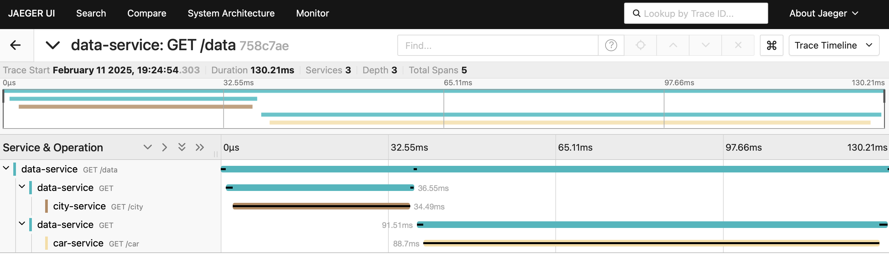

# OpenTelemetry Python tests

## Zero-code instrumentation with output to console

```bash
export OTEL_PYTHON_LOGGING_AUTO_INSTRUMENTATION_ENABLED=true

opentelemetry-instrument \
  --traces_exporter console \
  --metrics_exporter console \
  --logs_exporter console \
  --service_name counter-server \
  flask --app app01-zerocode-instrumentation run -p 8080
```

## Start OpenTelemetry Collector

```bash
docker run -p 4317:4317 \
  -v ./otel-collector-config.yaml:/etc/otel-collector-config.yaml \
  otel/opentelemetry-collector:latest \
  --config=/etc/otel-collector-config.yaml
```

## Automatic context propagation

[OpenTelemetry - Concepts - Context propagation](https://opentelemetry.io/docs/concepts/context-propagation/)  
[OpenTelemetry - Python Propagation](https://opentelemetry.io/docs/languages/python/propagation/)

```bash
export OTEL_PYTHON_LOGGING_AUTO_INSTRUMENTATION_ENABLED=true

# Start city service on port 8081
opentelemetry-instrument \
  --traces_exporter console,otlp \
  --metrics_exporter console,otlp \
  --logs_exporter console \
  --service_name city-service \
  flask --app app03-city-service run --port 8081

# Start car service on port 8082
opentelemetry-instrument \
  --traces_exporter console,otlp \
  --metrics_exporter console,otlp \
  --logs_exporter console \
  --service_name car-service \
  flask --app app04-car-service run --port 8082
 
# Start data service on port 8083 
opentelemetry-instrument \
  --traces_exporter console,otlp \
  --metrics_exporter console,otlp \
  --logs_exporter console \
  --service_name data-service \
  flask --app app05-data-service run --port 8083

# Start Jaeger
docker run --rm --name jaeger \
  -p 16686:16686 \
  -p 4317:4317 \
  -p 4318:4318 \
  -p 5778:5778 \
  -p 9411:9411 \
  jaegertracing/jaeger:2.3.0

# Call data service
curl --request GET --include http://localhost:8083/data
```

Result of the call to the data service:

```json
{
  "car": "BMW",
  "city": "Antwerp"
}

```

Result of the propagation that moves data between services in the Jaeger UI:


